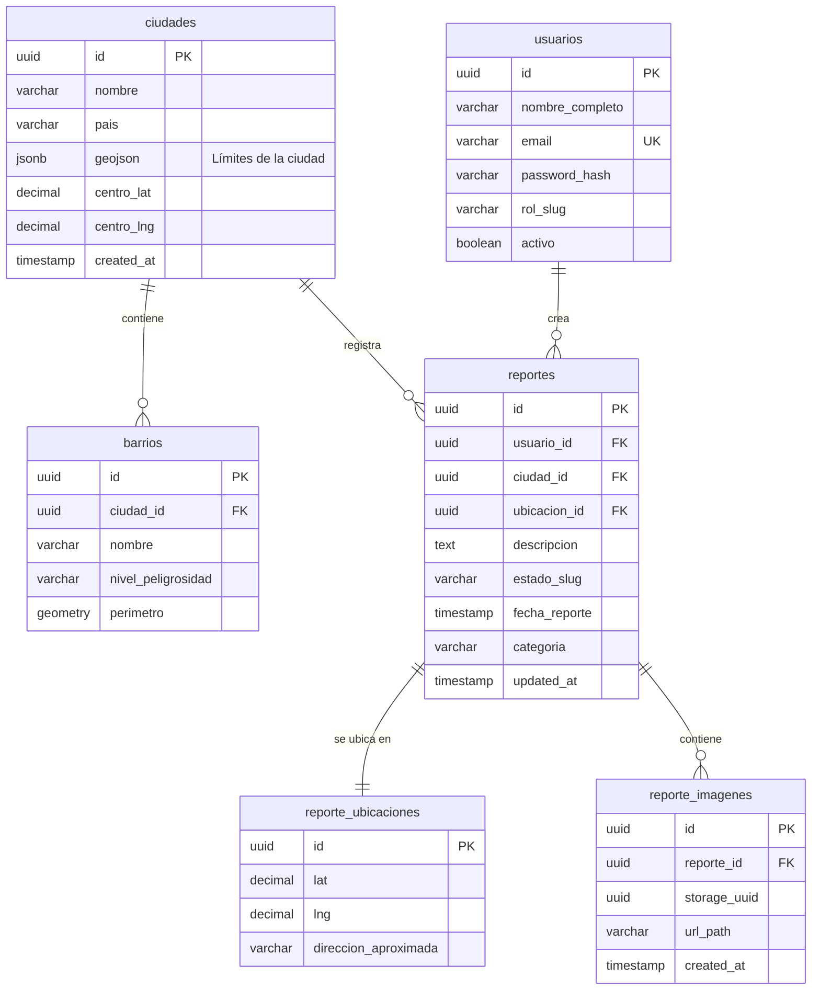

# CityAlerta

Aplicación móvil nativa para Android que permite a los usuarios de Manta, Manabí, Ecuador reportar incidentes urbanos y dar seguimiento a su resolución mediante la interacción con administradores y agencias responsables.

---

## Descripción

CityAlerta es una solución móvil orientada a mejorar la comunicación entre ciudadanos, administradores y entidades responsables (empresas de servicios públicos, seguridad, etc.). Los usuarios pueden reportar problemas geolocalizados, mientras que los administradores gestionan y derivan estos reportes a agencias correspondientes.

El sistema está diseñado con un enfoque escalable, permitiendo su evolución hacia un backend centralizado y un panel web administrativo.

---

## Especificaciones del Proyecto

- **Ubicación:** Manta, Manabí, Ecuador  
- **Plataforma:** Android Nativo  
- **Lenguaje:** Kotlin  
- **Framework de UI:** Jetpack Compose  
- **Arquitectura:** MVVM + Clean Architecture  
- **Principios:** SOLID  

---

## Stack Tecnológico

### Core
- Kotlin  
- Jetpack Compose  
- Android Architecture Components (ViewModel, StateFlow)  

### Persistencia
- Room Database (fuente local)  
- Preparado para integración con backend remoto (API REST o servicios como Firebase/Supabase)  

### Mapas y Geolocalización
- Google Maps SDK  
- Ubicación base: Lat -0.967653, Lng -80.708910  

### Inyección de Dependencias
- Hilt (recomendado)  

### Testing
- JUnit (unit testing)  
- Compose Testing Library (UI testing)  

---

## Arquitectura

El proyecto implementa **MVVM + Clean Architecture**, separando responsabilidades en capas bien definidas:

    ├── ui/ # Capa de presentación
    │ ├── screens/
    │ ├── components/
    │ └── navigation/
    ├── viewmodel/ # ViewModels (estado y lógica de UI)
    ├── domain/ # Lógica de negocio
    │ ├── model/ # Entidades de dominio
    │ ├── repository/ # Interfaces
    │ └── usecase/ # Casos de uso
    ├── data/ # Capa de datos
    │ ├── local/ # Room
    │ ├── remote/ # API
    │ └── repository/ # Implementaciones
    └── utils/ # Utilidades

---

## Principios de Diseño

### SOLID

- **Single Responsibility:** Cada clase tiene una única responsabilidad.  
- **Open/Closed:** El sistema permite extensión sin modificar código existente.  
- **Liskov Substitution:** Las implementaciones pueden sustituirse sin afectar el sistema.  
- **Interface Segregation:** Interfaces específicas y no monolíticas.  
- **Dependency Inversion:** Dependencias hacia abstracciones, no implementaciones.  

### Clean Architecture

- Separación clara entre UI, dominio y datos.  
- El dominio no depende de frameworks externos.  
- Uso de casos de uso para encapsular lógica de negocio.  

---

## Modelo de Datos (Alineado con ERD)

---

## Estados del Reporte

Se recomienda el uso de un enum:

    PENDIENTE
    EN_PROCESO
    RESUELTO

---

## Casos de Uso (Ejemplos)

- CrearReporteUseCase  
- ObtenerReportesUseCase  
- AsignarAgenciaUseCase  
- CambiarEstadoReporteUseCase  
- SubirImagenReporteUseCase  

---

## Repositorios (Abstracción)

Ejemplo:

kotlin
    ``
    interface ReporteRepository {
        suspend fun crearReporte(reporte: Reporte)
        suspend fun obtenerReportes(): List<Reporte>
        suspend fun asignarAgencia(reporteId: String, agenciaId: String)
    }``

---
## Flujo del Sistema
    El usuario crea un reporte desde la aplicación móvil.
    El sistema almacena el reporte localmente y/o en backend.
    El administrador visualiza los reportes.
    El administrador asigna una agencia.
    La agencia gestiona el incidente.
    El estado del reporte se actualiza hasta su resolución.
---
## Funcionalidades Principales
Navegación:

    Explorar (feed de reportes)
    Crear reporte
    Mapa interactivo
  
Autenticación:

    Registro y login
    Modo invitado (solo lectura)
  
Reportes:

    Creación con ubicación
    Asociación a barrios
    Subida de imágenes
    Seguimiento de estado

---

## Escalabilidad
El sistema está diseñado para evolucionar hacia:

    Backend centralizado (API REST / GraphQL)
    Sincronización en tiempo real
    Panel web administrativo
    Notificaciones push
    Integración con servicios externos
---

## Roadmap

     Implementación de casos de uso (UseCases)
     Integración con backend remoto
     Sistema de asignación de agencias
     Gestión de estados de reportes
     Subida de imágenes
     Panel web para administradores
     Notificaciones push
     Sistema de comentarios

---

## Guías de Desarrollo
Nomenclatura:

    PascalCase: Clases, composables
    camelCase: Variables, funciones
    Inglés: Código
    Español: UI
Buenas Prácticas:

    Evitar lógica en la UI
    Uso de StateFlow en lugar de LiveData
    Separación estricta de capas
    Testing de casos de uso

---

## Testing
  Unit Testing:
  
      Casos de uso
      Validaciones
      Repositorios
  UI Testing:
  
      Componentes Compose
      Flujos de usuario

---

## Instalación
  Prerrequisitos:
  
    Android Studio Flamingo o superior
    JDK 11 o superior
    SDK de Android 31+

  Pasos:
  
    git clone <repositorio>
    cd CityAlerta
    ./gradlew build
    ./gradlew installDebug

---

## Contribuciones
Commits
  Formato:

    tipo: descripcion

  Ejemplo:

    feat: agregar creacion de reportes

---

## Pull Requests
    Incluir tests
    Documentar cambios
    Seguir arquitectura establecida
