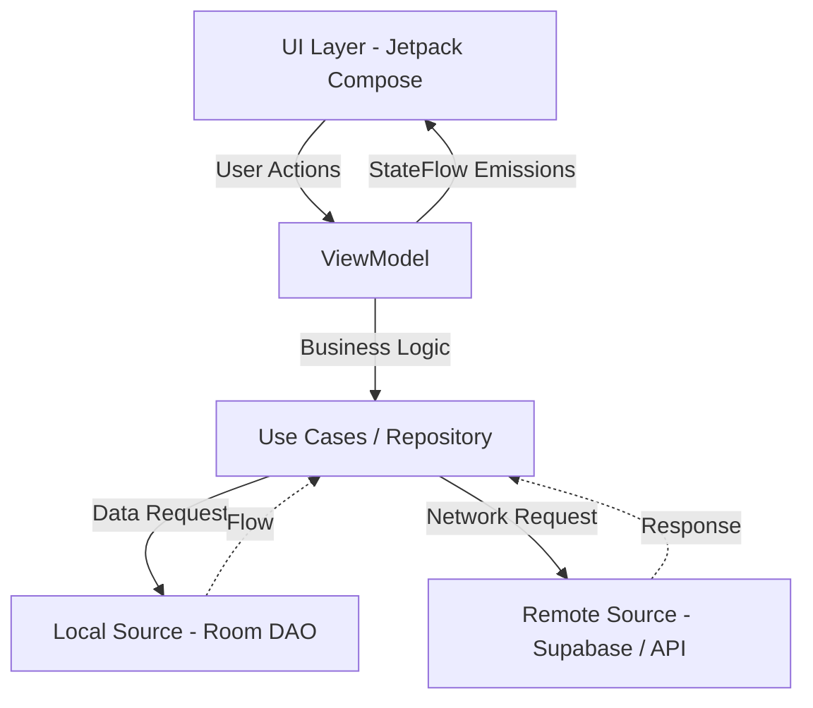

# CityAlerta

    

CityAlerta es una aplicación móvil nativa para Android diseñada para mejorar la comunicación entre ciudadanos y autoridades mediante el reporte geolocalizado de incidentes urbanos. Los ciudadanos pueden reportar problemas en tiempo real, mientras que las entidades responsables gestionan, categorizan y derivan estos reportes para su resolución eficiente.

---

## Arquitectura y Patrones

El proyecto implementa **MVVM (Model-View-ViewModel)** combinado con **Clean Architecture**. Esta separación estricta de responsabilidades garantiza un código escalable, testeable y mantenible. 

### Flujo de Datos



---

## Stack Tecnológico

### Core & UI
- **Lenguaje:** Kotlin
- **UI Toolkit:** Jetpack Compose (Material Design 3)
- **Arquitectura:** Android Architecture Components (ViewModel, StateFlow, Coroutines)

### Persistencia & Backend
- **Local:** Room Database
- **Remoto:** Supabase (GoTrue, PostgREST, Storage, Realtime)
- **Networking:** Ktor Client

### Mapas & Multimedia
- **Geolocalización:** Google Maps SDK & Maps Compose
- **Cámara:** CameraX
- **Imágenes:** Coil Compose

### Testing
- **Unit Testing:** JUnit 4, Kotlinx Coroutines Test, Mockito

---

## Estrategia de Testing (TDD)

El proyecto sigue la metodología **Test-Driven Development (TDD)** (Red-Green-Refactor) para blindar la lógica de negocio y garantizar la resiliencia del sistema. 

Nuestra suite de pruebas cubre:
- **Validación de Datos:** Verificación de campos obligatorios, formatos y estados iniciales en la creación de reportes.
- **Operaciones CRUD:** Pruebas sobre la capa de persistencia (Repositories y DAOs) para asegurar la correcta inserción, lectura y manejo de errores.
- **Flujos de Estado:** Validación de las emisiones de `StateFlow` en los ViewModels (`Loading`, `Success`, `Error`).

Para ejecutar la suite completa de pruebas desde la terminal, utiliza el siguiente comando:

```bash
./gradlew test
```

---

## Configuración Local

Para ejecutar el proyecto en tu entorno local, sigue estos pasos:

1. **Clonar el repositorio:**
   ```bash
   git clone <URL_DEL_REPOSITORIO>
   cd CityAlerta
   ```

2. **Configurar variables de entorno:**
   El proyecto utiliza credenciales para servicios externos (Google Maps, Supabase, Gemini). Renombra o copia el archivo de ejemplo para crear tus variables locales:
   ```bash
   cp local.properties.example local.properties
   ```
   Abre `local.properties` y reemplaza los valores de ejemplo con tus propias API Keys y credenciales.

3. **Compilar y Ejecutar:**
   Abre el proyecto en Android Studio (Flamingo o superior) o usa Gradle desde la terminal:
   ```bash
   ./gradlew installDebug
   ```

---

## AI & Automation Roadmap

Como parte de la evolución tecnológica de CityAlerta, planeamos integrar capacidades de Inteligencia Artificial para automatizar y agilizar el trabajo de las agencias de respuesta.

### Especificación: Endpoint de IA para Categorización y Severidad

**Objetivo:** Analizar automáticamente la descripción y el contexto del reporte para asignar una categoría sugerida y evaluar el nivel de severidad (Bajo, Medio, Alto, Crítico) sin intervención humana inicial.

**Flujo Propuesto:**
1. **Interceptación del Reporte:** Al crearse un reporte, un Edge Function (Supabase) o Worker captura el evento.
2. **Procesamiento de Lenguaje Natural (NLP):**
   - El texto del reporte se envía a un modelo de lenguaje (ej. Gemini o Claude) mediante un prompt estructurado.
   - El modelo extrae palabras clave (ej. "fuego", "armas", "bache") e identifica el tono de urgencia.
3. **Clasificación y Salida:**
   - Retorna un JSON estructurado con la categoría recomendada (ej. `INCENDIO`, `VANDALISMO`) y un score de severidad de 1 a 10.
4. **Actualización Automática:** El sistema actualiza el registro en la base de datos y, si la severidad es crítica, dispara notificaciones push inmediatas a los administradores de zona.

*Este módulo transformará a CityAlerta de un sistema pasivo de recolección de datos a una plataforma de triaje inteligente en tiempo real.*
