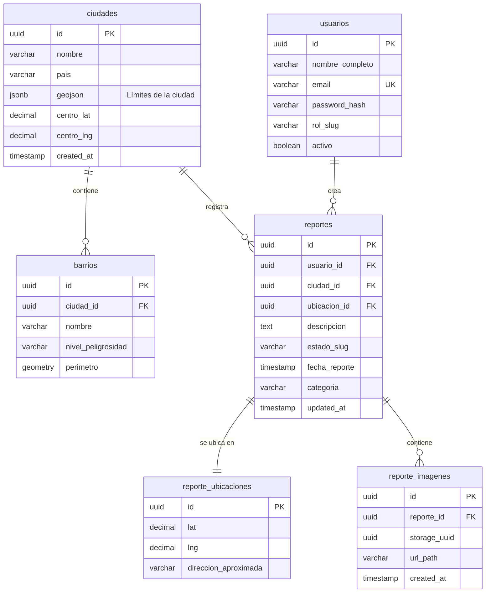

```mermaid
erDiagram
    direction TB
    ciudades {
        uuid id PK ""
        varchar nombre ""
        varchar pais ""
        jsonb geojson "Límites de la ciudad"
        decimal centro_lat ""
        decimal centro_lng ""
        timestamp created_at ""
    }

    barrios {
        uuid id PK ""
        uuid ciudad_id FK ""
        varchar nombre ""
        varchar nivel_peligrosidad ""
        geometry perimetro ""
    }

    reportes {
        uuid id PK ""
        uuid usuario_id FK ""
        uuid ciudad_id FK ""
        uuid ubicacion_id FK ""
        text descripcion ""
        varchar estado_slug ""
        timestamp fecha_reporte ""
        varchar categoria ""
        timestamp updated_at ""
    }

    reporte_ubicaciones {
        uuid id PK ""
        decimal lat ""
        decimal lng ""
        varchar direccion_aproximada ""
    }

    reporte_imagenes {
        uuid id PK ""
        uuid reporte_id FK ""
        uuid storage_uuid ""
        varchar url_path ""
        timestamp created_at ""
    }

    usuarios {
        uuid id PK ""
        varchar nombre_completo ""
        varchar email UK ""
        varchar password_hash ""
        varchar rol_slug ""
        boolean activo ""
    }

    usuarios ||--o{ reportes : "crea"
    ciudades ||--o{ barrios : "contiene"
    ciudades ||--o{ reportes : "registra"
    reportes ||--|| reporte_ubicaciones : "se ubica en"
    reportes ||--o{ reporte_imagenes : "contiene"
```